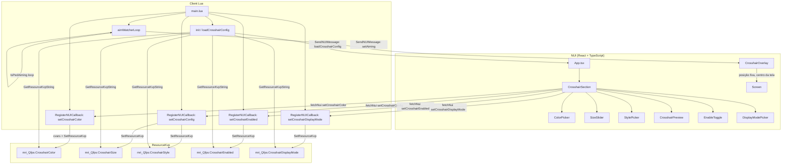

# Design Técnico — Crosshair Config

## Visão Geral

A feature `crosshair-config` adiciona uma seção de configuração de mira ao menu NUI existente (`/fps`) do recurso `mri_Qfps`. O jogador pode personalizar cor, tamanho, estilo, ativação e **modo de exibição** da mira customizada diretamente pela interface.

Como o GTA V não expõe natives para tamanho e estilo de crosshair, a solução usa dois mecanismos complementares:

1. **Mira nativa**: cor controlada via console variables (`cl_crosshaircolor_r/g/b/a`) no Lua client-side.
2. **Overlay NUI**: elemento HTML/CSS posicionado sobre o centro da tela, renderizado pela NUI, que implementa tamanho e estilo customizados.

O **modo de exibição** controla quando o overlay aparece:
- **`always`** (Mira Fixa): o overlay fica visível o tempo todo, independente do que o jogador esteja fazendo.
- **`aiming`** (Mira ao Mirar): o overlay só aparece quando o jogador está mirando com uma arma — detectado via `IsPedAiming(PlayerPedId())` em um loop Lua que envia mensagens NUI em tempo real.

As configurações são persistidas via `ResourceKvp` e restauradas nos eventos `onResourceStart` e `QBCore:Client:OnPlayerLoaded`.

---

## Arquitetura



**Fluxo de inicialização:**
1. `init()` lê todos os KVPs de crosshair, incluindo `displayMode`.
2. Aplica a cor salva via console variables.
3. Envia `SendNUIMessage({ action: 'loadCrosshairConfig', data: config })` para a NUI.
4. A NUI aplica o estado ao `CrosshairOverlay` e ao formulário.
5. Se `displayMode === 'aiming'`, o loop `aimWatcherLoop` é iniciado.

**Fluxo de aplicação de config:**
1. Usuário interage com `CrosshairSection` → estado local React atualizado.
2. Preview reativo via estado local (sem callback Lua).
3. Ao clicar "Aplicar Mira" ou selecionar cor/modo → `fetchNui` dispara o callback Lua correspondente.
4. Lua persiste no KVP e aplica a native.

**Fluxo do modo `aiming`:**
1. Loop Lua (`aimWatcherLoop`) roda a cada frame enquanto `displayMode === 'aiming'`.
2. Detecta mudança de estado via `IsPedAiming(PlayerPedId())`.
3. Ao mudar, envia `SendNUIMessage({ action: 'setAiming', data: { aiming: bool } })`.
4. `CrosshairOverlay` usa o estado `aiming` recebido para decidir se renderiza.
5. Quando `displayMode` muda para `always`, o loop é encerrado e o overlay volta a ser sempre visível.

---

## Componentes e Interfaces

### Componentes React

#### `CrosshairSection`
Componente container que agrega todos os sub-componentes da seção de mira. Gerencia o estado local de `pendingConfig` (configuração em edição antes de aplicar).

```typescript
interface CrosshairConfig {
  color: CrosshairColor;
  size: number;        // 4–32 px
  style: CrosshairStyle;
  enabled: boolean;
  displayMode: CrosshairDisplayMode;
}

type CrosshairStyle = 'dot' | 'cross' | 'circle';

type CrosshairDisplayMode = 'always' | 'aiming';

interface CrosshairColor {
  r: number;  // 0–255
  g: number;
  b: number;
  a: number;
}
```

Props: nenhuma (lê estado via `useNuiEvent('loadCrosshairConfig', ...)`).

#### `ColorPicker`
Grid de swatches de cor. Destaca a cor ativa com borda/fundo diferenciado.

```typescript
interface ColorPickerProps {
  value: CrosshairColor;
  onChange: (color: CrosshairColor) => void;
}
```

Cores predefinidas (constante):
```typescript
const PRESET_COLORS: { label: string; color: CrosshairColor }[] = [
  { label: 'Branco',   color: { r: 255, g: 255, b: 255, a: 255 } },
  { label: 'Vermelho', color: { r: 255, g: 0,   b: 0,   a: 255 } },
  { label: 'Verde',    color: { r: 0,   g: 255, b: 0,   a: 255 } },
  { label: 'Amarelo',  color: { r: 255, g: 255, b: 0,   a: 255 } },
  { label: 'Ciano',    color: { r: 0,   g: 255, b: 255, a: 255 } },
];
```

Ao selecionar uma cor, dispara `fetchNui('setCrosshairColor', color)` imediatamente (sem necessidade de "Aplicar").

#### `SizeSlider`
Slider HTML range com `min=4`, `max=32`, `step=1`. Atualiza o estado local em tempo real.

```typescript
interface SizeSliderProps {
  value: number;
  onChange: (size: number) => void;
}
```

#### `StylePicker`
Seletor de estilo com 3 opções visuais (ícone + label). Destaca o estilo ativo.

```typescript
interface StylePickerProps {
  value: CrosshairStyle;
  onChange: (style: CrosshairStyle) => void;
}
```

#### `DisplayModePicker`
Seletor de modo de exibição com 2 opções. Destaca o modo ativo. Ao selecionar, dispara `fetchNui('setCrosshairDisplayMode', { displayMode })` imediatamente.

```typescript
interface DisplayModePickerProps {
  value: CrosshairDisplayMode;
  onChange: (mode: CrosshairDisplayMode) => void;
}
```

Opções:
- `always` — "Mira Fixa": ícone de olho aberto, label "Sempre visível"
- `aiming` — "Mira ao Mirar": ícone de mira/arma, label "Ao mirar"

#### `CrosshairPreview`
Renderiza o `CrosshairOverlay` em miniatura dentro de um container com fundo escuro (`#1A1A1A`). Recebe a config atual e reflete mudanças em tempo real. No modo preview, o `displayMode` é ignorado — a mira é sempre exibida para fins de visualização.

```typescript
interface CrosshairPreviewProps {
  config: CrosshairConfig;
}
```

#### `CrosshairOverlay`
Elemento posicionado fixo no centro da tela (`position: fixed`, `top: 50%`, `left: 50%`, `transform: translate(-50%, -50%)`). Renderizado fora do menu, visível quando `enabled = true` e o menu está fechado.

A visibilidade depende do `displayMode`:
- `always`: renderiza sempre que `enabled = true`.
- `aiming`: renderiza apenas quando `enabled = true` **e** o estado `aiming` (recebido via `useNuiEvent('setAiming', ...)`) for `true`.

```typescript
interface CrosshairOverlayProps {
  config: CrosshairConfig;
  preview?: boolean; // quando true, renderiza em modo miniatura (sem position fixed, displayMode ignorado)
}
```

Estilos por tipo:
- `dot`: `border-radius: 50%`, quadrado de `size × size` px.
- `cross`: dois retângulos sobrepostos (pseudo-elementos CSS ou dois `div`s).
- `circle`: `border-radius: 50%`, apenas borda, sem preenchimento.

#### `EnableToggle`
Checkbox estilizado ou switch. Ao mudar, dispara `fetchNui('setCrosshairEnabled', { enabled })`.

```typescript
interface EnableToggleProps {
  value: boolean;
  onChange: (enabled: boolean) => void;
}
```

### NUI Callbacks (Lua)

| Callback | Payload | Ação Lua |
|---|---|---|
| `setCrosshairColor` | `{ r, g, b, a }` | cvars de cor + KVP |
| `setCrosshairConfig` | `{ size, style }` | KVP size + KVP style |
| `setCrosshairEnabled` | `{ enabled }` | KVP enabled + `SendNUIMessage` |
| `setCrosshairDisplayMode` | `{ displayMode }` | KVP displayMode + inicia/para `aimWatcherLoop` |

### NUI Messages (Lua → NUI)

| Action | Data | Descrição |
|---|---|---|
| `loadCrosshairConfig` | `CrosshairConfig` | Carrega config salva ao iniciar |
| `setAiming` | `{ aiming: boolean }` | Notifica a NUI sobre mudança de estado de mira (modo `aiming`) |

---

## Modelos de Dados

### Estado React (`CrosshairSection`)

```typescript
// Config aplicada (sincronizada com KVP)
const [appliedConfig, setAppliedConfig] = useState<CrosshairConfig>(DEFAULT_CONFIG);

// Config em edição (preview em tempo real, antes de aplicar)
const [pendingConfig, setPendingConfig] = useState<CrosshairConfig>(DEFAULT_CONFIG);
```

> Cor e modo de exibição são aplicados imediatamente (sem pending). Tamanho e estilo ficam em `pendingConfig` até "Aplicar Mira".

### Valores Padrão

```typescript
const DEFAULT_CONFIG: CrosshairConfig = {
  color:       { r: 255, g: 255, b: 255, a: 255 },
  size:        10,
  style:       'dot',
  enabled:     true,
  displayMode: 'always',
};
```

### Chaves ResourceKvp

| Chave | Tipo | Exemplo |
|---|---|---|
| `mri_Qfps:CrosshairColor` | JSON string | `'{"r":255,"g":0,"b":0,"a":255}'` |
| `mri_Qfps:CrosshairSize` | string numérica | `'10'` |
| `mri_Qfps:CrosshairStyle` | string | `'dot'` |
| `mri_Qfps:CrosshairEnabled` | string booleana | `'true'` |
| `mri_Qfps:CrosshairDisplayMode` | string | `'always'` ou `'aiming'` |

A cor é serializada como JSON para preservar os 4 canais RGBA em uma única chave KVP (que só suporta strings).

### Estrutura de Arquivos

```
ui/src/
  components/
    crosshair/
      CrosshairSection.tsx   ← container principal
      ColorPicker.tsx
      SizeSlider.tsx
      StylePicker.tsx
      DisplayModePicker.tsx  ← NOVO: seletor de modo de exibição
      CrosshairPreview.tsx
      CrosshairOverlay.tsx   ← atualizado: lógica de displayMode + setAiming
      EnableToggle.tsx
      types.ts               ← atualizado: CrosshairDisplayMode adicionado
      constants.ts           ← atualizado: DEFAULT_CONFIG com displayMode

client/
  main.lua                   ← atualizado: callback setCrosshairDisplayMode + aimWatcherLoop
```

---

## Propriedades de Corretude

*Uma propriedade é uma característica ou comportamento que deve ser verdadeiro em todas as execuções válidas de um sistema — essencialmente, uma declaração formal sobre o que o sistema deve fazer. Propriedades servem como ponte entre especificações legíveis por humanos e garantias de corretude verificáveis por máquina.*

### Propriedade 1: Carregamento reflete configuração salva

*Para qualquer* configuração válida de crosshair (cor, tamanho, estilo, enabled) armazenada no KVP, quando o menu é aberto e recebe a mensagem `loadCrosshairConfig`, o estado do componente `CrosshairSection` deve refletir exatamente os valores recebidos.

**Valida: Requisitos 1.2**

---

### Propriedade 2: Seleção ativa é destacada visualmente

*Para qualquer* lista de opções (cores ou estilos) e qualquer item selecionado, somente o item selecionado deve receber a classe CSS de destaque ativo, e todos os demais não devem tê-la.

**Valida: Requisitos 2.5, 4.5**

---

### Propriedade 3: Callback de cor carrega os valores RGBA corretos

*Para qualquer* cor selecionada do conjunto de cores predefinidas, o `fetchNui('setCrosshairColor', ...)` deve ser chamado com os valores `{ r, g, b, a }` exatamente correspondentes à cor selecionada.

**Valida: Requisitos 2.2**

---

### Propriedade 4: Native de cor recebe os valores do callback

*Para qualquer* conjunto de valores RGBA recebidos pelo callback `setCrosshairColor`, a função `SetCrosshairColour(r, g, b, a)` deve ser chamada com os mesmos valores.

**Valida: Requisitos 2.3**

---

### Propriedade 5: Preview reativo a qualquer mudança de config

*Para qualquer* valor de tamanho no intervalo [4, 32] ou qualquer estilo em `{ dot, cross, circle }`, ao alterar o valor no formulário, o componente `CrosshairPreview` deve imediatamente refletir o novo valor sem necessidade de clicar em "Aplicar Mira".

**Valida: Requisitos 3.2, 4.2, 6.2**

---

### Propriedade 6: Aplicar config dispara callback com valores corretos

*Para qualquer* combinação de tamanho e estilo selecionados, ao clicar em "Aplicar Mira", o `fetchNui('setCrosshairConfig', { size, style })` deve ser chamado com exatamente os valores que estavam em `pendingConfig`.

**Valida: Requisitos 3.3, 4.3**

---

### Propriedade 7: Persistência completa de todas as propriedades

*Para qualquer* configuração completa de crosshair (cor, tamanho, estilo, enabled, displayMode), ao aplicar, todos os cinco valores devem ser persistidos no ResourceKvp nas chaves corretas antes de retornar `cb("ok")`.

**Valida: Requisitos 3.4, 4.4, 5.1, 7.5, 8.4**

---

### Propriedade 8: Round-trip de persistência

*Para qualquer* configuração válida de crosshair, serializar os valores para o ResourceKvp e depois recuperá-los deve produzir valores equivalentes aos originais (cor RGBA, tamanho numérico, estilo string, enabled booleano, displayMode string).

**Valida: Requisitos 5.4**

---

### Propriedade 9: Toggle do overlay

*Para qualquer* estado atual do overlay (ativo ou inativo), receber o callback `setCrosshairEnabled` com o valor oposto deve alternar a visibilidade do `CrosshairOverlay` para o novo estado.

**Valida: Requisitos 7.3, 7.4**

---

### Propriedade 10: Modo `always` exibe overlay independente do estado de mira

*Para qualquer* valor do estado `aiming` (true ou false), quando `displayMode === 'always'` e `enabled === true`, o `CrosshairOverlay` deve estar visível.

**Valida: Requisito 8.2**

---

### Propriedade 11: Modo `aiming` exibe overlay somente ao mirar

*Para qualquer* par de valores `(aiming, enabled)`, quando `displayMode === 'aiming'`:
- Se `enabled === true` e `aiming === true` → overlay visível.
- Se `enabled === true` e `aiming === false` → overlay oculto.
- Se `enabled === false` → overlay sempre oculto, independente de `aiming`.

**Valida: Requisito 8.3**

---

### Propriedade 12: Mudança de modo dispara callback com valor correto

*Para qualquer* valor de `displayMode` em `{ 'always', 'aiming' }`, ao selecionar o modo no `DisplayModePicker`, o `fetchNui('setCrosshairDisplayMode', { displayMode })` deve ser chamado com exatamente o valor selecionado.

**Valida: Requisito 8.4**

---

## Tratamento de Erros

### NUI → Lua

- Se `fetchNui` falhar (timeout ou erro de rede NUI), o estado local React não é revertido. O erro é silenciado no console de desenvolvimento. Em produção FiveM, falhas de NUI callback são raras e não críticas para UX.
- Valores fora do range (tamanho < 4 ou > 32) são rejeitados pelo slider HTML nativo (`min`/`max`). O Lua valida adicionalmente com `math.max(4, math.min(32, size))` antes de persistir.
- Valores inválidos para `displayMode` (diferentes de `'always'` ou `'aiming'`) são ignorados pelo Lua, que mantém o valor anterior ou usa o padrão `'always'`.

### Lua — KVP

- `GetResourceKvpString` retorna `nil` se a chave não existir. Todos os acessos usam o padrão `valor or default`.
- A cor é armazenada como JSON. Se `json.decode` falhar (dado corrompido), o Lua usa a cor padrão branca.
- `displayMode` desconhecido no KVP → fallback para `'always'`.

### Valores Padrão (fallback)

```lua
-- Lua: leitura segura com fallback
local function loadCrosshairConfig()
    local colorJson = GetResourceKvpString("mri_Qfps:CrosshairColor")
    local color = colorJson and json.decode(colorJson) or { r=255, g=255, b=255, a=255 }
    local size = tonumber(GetResourceKvpString("mri_Qfps:CrosshairSize")) or 10
    local style = GetResourceKvpString("mri_Qfps:CrosshairStyle") or "dot"
    local enabledStr = GetResourceKvpString("mri_Qfps:CrosshairEnabled")
    local enabled = enabledStr == nil and true or (enabledStr == "true")
    local displayMode = GetResourceKvpString("mri_Qfps:CrosshairDisplayMode") or "always"
    -- Validar displayMode
    if displayMode ~= "always" and displayMode ~= "aiming" then
        displayMode = "always"
    end
    return { color = color, size = size, style = style, enabled = enabled, displayMode = displayMode }
end
```

### Loop `aimWatcherLoop`

O loop é gerenciado por uma variável de controle `isAimWatcherRunning`. Ao mudar para `aiming`, o loop é iniciado se ainda não estiver rodando. Ao mudar para `always`, a variável é setada para `false` e o loop encerra na próxima iteração. Isso evita múltiplos loops concorrentes.

---

## Estratégia de Testes

### Abordagem Dual

A estratégia combina testes unitários (exemplos específicos e casos de borda) com testes baseados em propriedades (cobertura ampla via geração aleatória de inputs).

**Biblioteca de testes unitários**: Vitest + React Testing Library
**Biblioteca de testes baseados em propriedades**: `fast-check` (TypeScript/JavaScript)
**Configuração mínima**: 100 iterações por propriedade (`fc.configureGlobal({ numRuns: 100 })`)

---

### Testes Unitários (Exemplos e Casos de Borda)

**Componentes React:**
- Renderiza `CrosshairSection` com `DEFAULT_CONFIG` e verifica presença dos sub-componentes.
- Renderiza `ColorPicker` com 5 cores e verifica que todas estão presentes.
- Renderiza `SizeSlider` e verifica atributos `min=4`, `max=32`, `step=1`.
- Renderiza `StylePicker` com 3 estilos e verifica presença de `dot`, `cross`, `circle`.
- Renderiza `DisplayModePicker` com 2 modos e verifica presença de `always` e `aiming`.
- Renderiza `CrosshairPreview` sobre fundo `#1A1A1A`.
- Renderiza `EnableToggle` e verifica presença do controle.
- Caso de borda: `loadCrosshairConfig` com KVP vazio → aplica `DEFAULT_CONFIG`.
- Caso de borda: JSON de cor corrompido no KVP → fallback para branco.
- Caso de borda: `displayMode` inválido no KVP → fallback para `'always'`.
- Modo `always`: overlay visível independente do estado `aiming`.
- Modo `aiming` + `aiming=false`: overlay oculto.
- Modo `aiming` + `aiming=true`: overlay visível.

**Lua (usando busted):**
- `loadCrosshairConfig` com KVP vazio retorna defaults (incluindo `displayMode = 'always'`).
- `setCrosshairDisplayMode` com `'aiming'` inicia o `aimWatcherLoop`.
- `setCrosshairDisplayMode` com `'always'` para o `aimWatcherLoop`.
- `setCrosshairDisplayMode` com valor inválido é ignorado.

---

### Testes Baseados em Propriedades

Cada teste de propriedade referencia a propriedade do design com o tag:
`// Feature: crosshair-config, Property N: <texto>`

**Propriedade 1 — Carregamento reflete configuração salva**
```typescript
// Feature: crosshair-config, Property 1: Carregamento reflete configuração salva
fc.assert(fc.property(
  arbitraryCrosshairConfig(),
  (config) => {
    const { result } = renderHook(() => useCrosshairConfig());
    act(() => fireNuiMessage('loadCrosshairConfig', config));
    expect(result.current.config).toEqual(config);
  }
));
```

**Propriedade 2 — Seleção ativa é destacada visualmente**
```typescript
// Feature: crosshair-config, Property 2: Seleção ativa é destacada visualmente
fc.assert(fc.property(
  fc.integer({ min: 0, max: 4 }),
  (selectedIndex) => {
    const { getAllByRole } = render(<ColorPicker value={PRESET_COLORS[selectedIndex].color} onChange={() => {}} />);
    const swatches = getAllByRole('button');
    swatches.forEach((swatch, i) => {
      if (i === selectedIndex) expect(swatch).toHaveClass('ring-2');
      else expect(swatch).not.toHaveClass('ring-2');
    });
  }
));
```

**Propriedade 3 — Callback de cor carrega os valores RGBA corretos**
```typescript
// Feature: crosshair-config, Property 3: Callback de cor carrega os valores RGBA corretos
fc.assert(fc.property(
  fc.integer({ min: 0, max: 4 }),
  (colorIndex) => {
    const mockFetchNui = vi.fn();
    const color = PRESET_COLORS[colorIndex].color;
    const { getAllByRole } = render(<ColorPicker value={DEFAULT_CONFIG.color} onChange={(c) => mockFetchNui('setCrosshairColor', c)} />);
    fireEvent.click(getAllByRole('button')[colorIndex]);
    expect(mockFetchNui).toHaveBeenCalledWith('setCrosshairColor', color);
  }
));
```

**Propriedade 5 — Preview reativo a qualquer mudança de config**
```typescript
// Feature: crosshair-config, Property 5: Preview reativo a qualquer mudança de config
fc.assert(fc.property(
  fc.integer({ min: 4, max: 32 }),
  fc.constantFrom('dot', 'cross', 'circle' as CrosshairStyle),
  (size, style) => {
    const config = { ...DEFAULT_CONFIG, size, style };
    const { container } = render(<CrosshairPreview config={config} />);
    const overlay = container.querySelector('[data-testid="crosshair-overlay"]');
    expect(overlay).toHaveStyle({ width: `${size}px`, height: `${size}px` });
    expect(overlay).toHaveAttribute('data-style', style);
  }
));
```

**Propriedade 6 — Aplicar config dispara callback com valores corretos**
```typescript
// Feature: crosshair-config, Property 6: Aplicar config dispara callback com valores corretos
fc.assert(fc.property(
  fc.integer({ min: 4, max: 32 }),
  fc.constantFrom('dot', 'cross', 'circle' as CrosshairStyle),
  (size, style) => {
    const mockFetchNui = vi.fn().mockResolvedValue('ok');
    // ... render CrosshairSection com mock, ajustar slider e style, clicar Aplicar
    expect(mockFetchNui).toHaveBeenCalledWith('setCrosshairConfig', { size, style });
  }
));
```

**Propriedade 8 — Round-trip de persistência**
```typescript
// Feature: crosshair-config, Property 8: Round-trip de persistência
fc.assert(fc.property(
  arbitraryCrosshairConfig(),
  (config) => {
    const kvp: Record<string, string> = {};
    saveCrosshairConfigToKvp(config, kvp);
    const restored = loadCrosshairConfigFromKvp(kvp);
    expect(restored).toEqual(config);
  }
));
```

**Propriedade 9 — Toggle do overlay**
```typescript
// Feature: crosshair-config, Property 9: Toggle do overlay
fc.assert(fc.property(
  fc.boolean(),
  (initialEnabled) => {
    const { rerender, container } = render(<CrosshairOverlay config={{ ...DEFAULT_CONFIG, enabled: initialEnabled }} />);
    rerender(<CrosshairOverlay config={{ ...DEFAULT_CONFIG, enabled: !initialEnabled }} />);
    const overlay = container.querySelector('[data-testid="crosshair-overlay"]');
    if (!initialEnabled) expect(overlay).toBeVisible();
    else expect(overlay).not.toBeVisible();
  }
));
```

**Propriedade 10 — Modo `always` exibe overlay independente do estado de mira**
```typescript
// Feature: crosshair-config, Property 10: Modo always exibe overlay independente do estado de mira
fc.assert(fc.property(
  fc.boolean(), // aiming state
  (aiming) => {
    const config = { ...DEFAULT_CONFIG, displayMode: 'always' as CrosshairDisplayMode };
    const { container } = render(<CrosshairOverlay config={config} />);
    // Simula mensagem setAiming
    act(() => fireNuiMessage('setAiming', { aiming }));
    const overlay = container.querySelector('[data-testid="crosshair-overlay"]');
    expect(overlay).toBeVisible(); // sempre visível no modo always
  }
));
```

**Propriedade 11 — Modo `aiming` exibe overlay somente ao mirar**
```typescript
// Feature: crosshair-config, Property 11: Modo aiming exibe overlay somente ao mirar
fc.assert(fc.property(
  fc.boolean(), // enabled
  fc.boolean(), // aiming
  (enabled, aiming) => {
    const config = { ...DEFAULT_CONFIG, enabled, displayMode: 'aiming' as CrosshairDisplayMode };
    const { container } = render(<CrosshairOverlay config={config} />);
    act(() => fireNuiMessage('setAiming', { aiming }));
    const overlay = container.querySelector('[data-testid="crosshair-overlay"]');
    if (enabled && aiming) expect(overlay).toBeVisible();
    else expect(overlay).not.toBeVisible();
  }
));
```

**Propriedade 12 — Mudança de modo dispara callback com valor correto**
```typescript
// Feature: crosshair-config, Property 12: Mudança de modo dispara callback com valor correto
fc.assert(fc.property(
  fc.constantFrom('always', 'aiming' as CrosshairDisplayMode),
  (displayMode) => {
    const mockFetchNui = vi.fn().mockResolvedValue('ok');
    const { getAllByRole } = render(
      <DisplayModePicker value={DEFAULT_CONFIG.displayMode} onChange={(m) => mockFetchNui('setCrosshairDisplayMode', { displayMode: m })} />
    );
    const modeIndex = displayMode === 'always' ? 0 : 1;
    fireEvent.click(getAllByRole('button')[modeIndex]);
    expect(mockFetchNui).toHaveBeenCalledWith('setCrosshairDisplayMode', { displayMode });
  }
));
```
